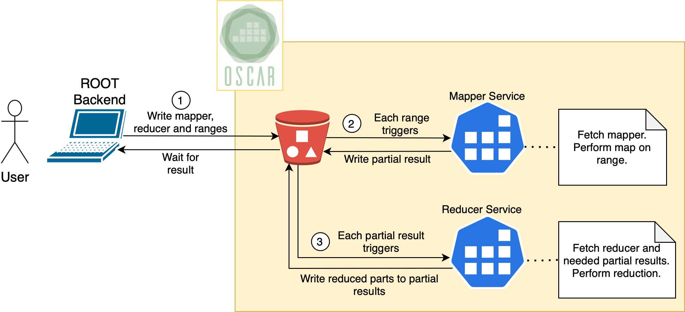
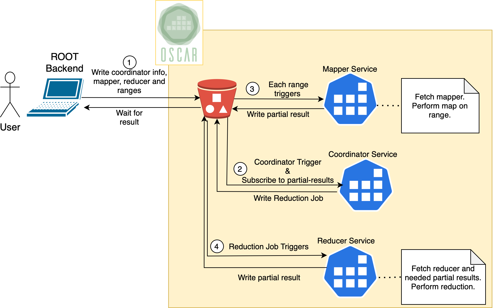

# Serverless Backend for ROOT's Distributed RDataFrame

This project contains the work developed for my master thesis: Implementation of an open source serverless backend (OSCAR) for ROOT. Thesis only in Spanish: https://riunet.upv.es/handle/10251/188409; paper in English: https://www.researchsquare.com/article/rs-2138404/v1. 

## Repository Structure

```
│	README.md
│
└─	figures/ 				# Figure source for README.md
│
└─	src/
|	└──	oscar/ 			
|	|	└── root-backend/ 	# OSCAR Backend Implementation in ROOT.
|	|	|	└── ...
|	|	└── root-client/ 	# ROOT client image.
|	|	|	└── ...
|	|	└── root-services/ 	# Services images.
|	|		└── ...
|	|
|	└─	scratch/ 		# PoC scripts of some functionalities.
|	|	└──	...
|	|
|	└─	utils/ 			# Python scripts to cleanup minio and oscar.
|		└──	...
|	
│
└─	tutorials/			# Basic tutorial to test both reduction backends and benchmarking. 
│		└──	...
└─	benchmarks/			# Benchmark and visualization scripts along with collected data.
	|	Benchmarking.ipynb
	|	Visualization.ipynb
	└──	...
```


## Usage

IMPORTANT: Please, use the docker images available in https://github.com/Break95?tab=packages&repo_name=TFM-ServerlessRoot, `distributed RDataFrame` is under development, so, building the images from scratch might not work. Also, if you find any problem trying to execute the tutorial feel free to open an issue. :)

You must have access to an OSCAR cluster (service creation/deletion and write authorization to the object storage service). You can deploy one on your local machine following this tutorial: https://docs.oscar.grycap.net/local-testing/

The backend can be used through Python or Jupyter Notebooks (as you need an environment with the serverless backend configured and it is not officially implemented in the root repository the easiest way is to launch the client docker image with docker run:

` docker run --rm --network host -v /path/to/tutorials/folder/:/tutorials/ -e minio_endpoint -e minio_access -e minio_secret -e oscar_endpoint -e oscar_access -e oscar_secret ghcr.io/break95/root-client`

NOTE: First run may take a longer time because OSCAR needs to download the images of the services.

It is recommended to map the tutorials folder of the repository to access the tutorial notebook. The environmental variables in the tutorial should already exist in the environment that invokes the docker run command, otherwise specify them manually in the notebook or in the docker command itself by specifying the value https://docs.docker.com/engine/reference/run/#env-environment-variables.

The backend will take care of service creation in OSCAR and storage management.


## Implementation summary

In brief, DistributedRDataFrame uses a Map-Reduce approach to perform the distributed computation and OSCAR is a serverless framework centered on a file-driven approach. The backend creates the Map and Reduce services and writes a file per worker requested with the information to the process. Each file will trigger the invocation of a mapper service, which will write their partial results to the object storage service.

For a more detailed description, please check the paper or the dissertation linked at the beginning. 

### Uncoordinated Approach

Each partial results triggers the invocation of a reduction service that will check with which other partial result it has to perform the reduction. Reductions are performed in a determined order to fix which pairs (or any other amount of elements) of partial results can be reduced together, the reduced file is written to the same location triggering another reducer service until all the necessary reduction operations have been performed. The ROOT client listens to the prefix where partial results are written to monitor progress and wait for final result. 



### Coordinated Approach

In this approach a coordinator service is created before the Mapper phase starts, and will monitor a prefix of the object storage system where the partial results, and launch reducer jobs as specified in the monitor configuration. The configuration is written to the file that triggers the coordinator service.

The monitor configuration is simple, it is just a list of integers containing the amount of partial results to batch together in each reduction. For example, if we have 8 partitions of the data we could specify [6, 3] to perform a two step reduction, in the first step 6 partial results will be reduced together and in the second step the two remaining partial results along with the partial result generated by the previous reduction will be reduced generating the final result.


